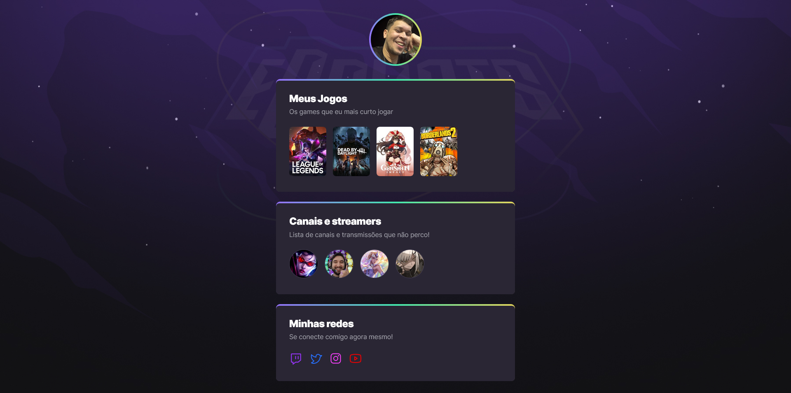

# NLW eSports - Trilha Explorer

Project build on the web event Next Level Week from Rocketseat.

## Table of contents

- [Overview](#overview)
  - [Screenshot](#screenshot)
  - [Links](#links)
- [My process](#my-process)
  - [Built with](#built-with)
  - [What I learned](#what-i-learned)
  - [Continued development](#continued-development)
- [Author](#author)

## Overview

### Screenshot



### Links

- [Live site](https://jallanoli.github.io/nwl-esports/)

## My process

### Built with

- Semantic HTML5 markup
- CSS custom properties
- Flexbox
- CSS Grid
- CSS animations

### What I learned

Learned the basics of CSS animations and how to do some interesting things, like a element border with a linear-gradient, using nested elements. Some new hover effects and background adaptations.

```html
<section class="card">
            <div class="my-games">
                <h2>Meus Jogos</h2>
                <p>Os games que eu mais curto jogar</p>
                <ul class="games-list">
                    <li>
                        <a target="_blank" href="https://www.twitch.tv/directory/game/League%20of%20Legends">
                            
                        </a>
                    </li>
                    <li>
                        <a target="_blank" href="https://www.twitch.tv/directory/game/Dead%20by%20Daylight">
                            
                        </a>
                    </li>
                    <li>
                        <a target="_blank" href="https://www.twitch.tv/directory/game/Genshin%20Impact">
                            
                        </a>
                    </li>
                    <li>
                        <a target="_blank" href="https://www.twitch.tv/directory/game/Borderlands%202">
                            
                        </a>
                    </li>
                </ul>
            </div>
        </section>
```
```css
@keyframes fromTop {
    from {
        opacity: 0;
        transform: translateY(-30px);
    }

    to {
        opacity: 1;
        transform: translateY(0);
    }
}

@keyframes fromBottom {
    from {
        opacity: 0;
        transform: translateY(30px);
    }

    to {
        opacity: 1;
        transform: translateY(0);
    }
}

@keyframes fromLeft {
    from {
        opacity: 0;
        transform: translateX(-30px);
    }

    to {
        opacity: 1;
        transform: translateX(0);
    }
}
```

### Continued development

Looking foward to improve this project, adapting more for mobile devices. Also thinking of adding some DOM manipulation to insert description to the games, streamers and an about me section that appears and disappears.

## Author

- Frontend Mentor - [@jAllanOli](https://www.frontendmentor.io/profile/jAllanOli)
- gitHub - [@jAllanOli](https://github.com/jAllanOli)